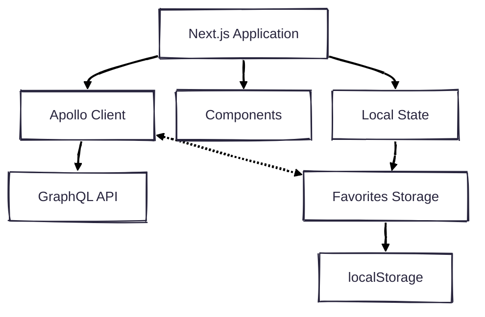

# Fight club movie posters

A performance-focused Next.js app showcasing movie posters with reactive filtering, SSG, stale-while-revalidate data caching and uniform data access via field policies

## Screenshot


## Architecture overview



## Key features

- **SSG with Apollo**: Static Site Generation with GraphQL and Apollo Client for balance of performance and freshness
- **Reactive state**: Uses Apollo field policies for local state management of favorites
- **Stale while revalidate**: Implements cache-and-network fetch policy to display cached data immediately while fetching fresh data in background, providing both instant response and eventual freshness
- **Data filtering**: Filter posters by language (English, Spanish, Portuguese) and by favorites (via field-policy and stored in local storage)

## Tech stack

### Core technologies

- **Framework**: [Next.js 15](https://nextjs.org/)

### Data management

- **GraphQL Client**: [Apollo Client](https://www.apollographql.com/docs/react/)
- **Local State**: Apollo reactive variables
- **Storage**: Browser localStorage

## Implementation details

### Performance-optimized data loading

The application implements a stale-while-revalidate strategy for optimal performance and user experience:

- **Static generation**: Data pre-fetched during build for instant initial page loads
- **Immediate response**: Displays cached data without waiting for network requests
- **Background refresh**: Updates data in the background without blocking UI interaction
- **Visual feedback**: Subtle line loader indicates background refreshes in progress
- **UI stability**: Prevents layout shifts during data updates
- **Priority loading**: Critical images load with priority flag for improved Core Web Vitals

This two-tier approach (cache + network) is implemented via Apollo Client's cache-and-network fetch policy, maintaining both performance and data freshness.


### Apollo Client setup

The application uses Apollo Client with separate configurations for client and server:

- **Server**: Pre-fetches data during SSG
- **Client**: Manages local state and additional data fetching

### Field policies for favorites

Custom field policies provide for reactive favoriting:

- Uses Apollo's reactive variables
- Accessed with server data thanks to field policies
- Persists to localStorage

## Credits

- **API**: [TMDB (The Movie Database)](https://developer.themoviedb.org/docs/getting-started) - Movie data provider
- **API wrapper**: [nerdsupremacist/tmdb](https://github.com/nerdsupremacist/tmdb) - GraphQL wrapper for TMDB API
- **Tyler image**: [indesition](https://www.deviantart.com/indesition) - Fight Club artwork

## Getting started

### Prerequisites

- [Node.js](https://nodejs.org/) >= 20
- [pnpm](https://pnpm.io/) >= 8

### Installation

```bash
# Clone the repository
git clone https://github.com/vincentbollaert/fightclub-movie-posters.git
cd fightclub-movie-posters

# Install dependencies
pnpm install

# Start development server
pnpm dev
```

### Building

```bash
# Build the application
pnpm build

# Start production server
pnpm start
```

---

Project by [Vincent Bollaert](https://github.com/vincentbollaert)
